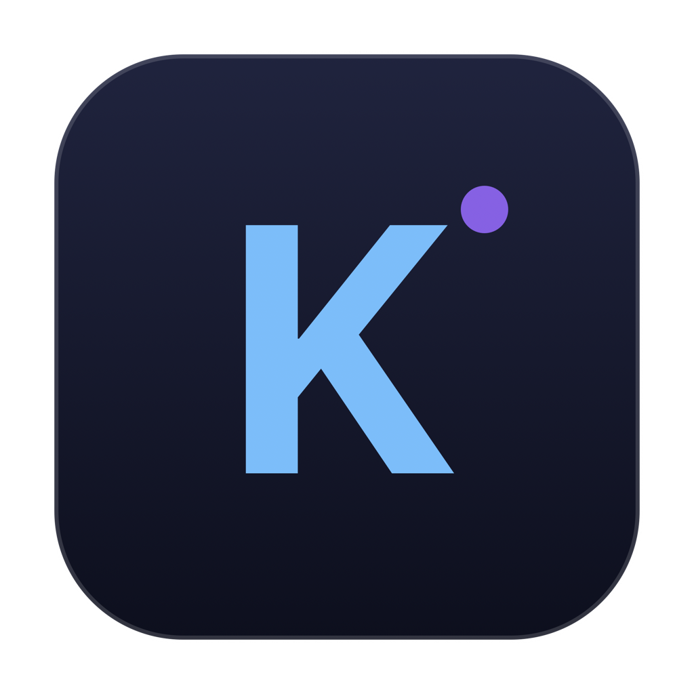

# Kimi Code for macOS

<p align="center">
  
</p>

专为 Kimi Code (`kimi web`) 封装的 macOS 原生客户端，基于 SwiftUI 与 WebKit 构建。

---

## 功能

- **后台常驻与服务自启**：打开 App 自动检测本地 `58627` 端口，未启动时自动通过 `tmux` 拉起后台服务；关闭 App 时保留服务继续运行。
- **顶部显示套餐用量**：直接在顶部工具栏显示每周限额与 5 小时限额百分比及重置倒计时（仅在前台活跃时刷新，窗口隐藏时暂停轮询）。
- **免密自动登录**：默认开启 `--dangerous-bypass-auth` 并自动读取本地 Token，无需手动输入。
- **快速切换工作目录**：顶部支持选择项目路径，切换时可一键重启服务生效，并自动记忆。
- **窗口与任务守护**：点击「X」仅隐藏窗口而不销毁，后台 Agent 任务不中断；再次打开瞬间呈现，自动记忆窗口尺寸。
- **轻量原生**：无 Electron 依赖，打包体积约 800 KB。

---

## 前置要求

- macOS 13.0+
- [Kimi CLI](https://github.com/MoonshotAI/kimi-code)：已安装且可执行 `kimi` 命令
- `tmux`：用于后台会话守护 (`brew install tmux`)
- Xcode Command Line Tools（仅源码构建需要）

---

## 构建与运行

```bash
git clone https://github.com/JianMoYu/kimi-macos.git
cd kimi-macos

# 编译生成 Kimi.app
./scripts/build.sh

# 或一键生成 DMG 安装包
./scripts/package_dmg.sh
```

构建产物位于 `dist/` 目录：
- `dist/Kimi.app`
- `dist/Kimi-Installer-arm64.dmg`

---

## 快捷键

| 快捷键 | 说明 |
| :--- | :--- |
| `Cmd + R` | 刷新页面与用量 |
| `Cmd + Shift + R` | 重启后台 Kimi 服务 |
| `Cmd + W` | 隐藏窗口（后台任务继续执行） |
| `Cmd + Q` | 退出 App（后台服务保留） |

---

## 开源协议

[MIT License](LICENSE)
